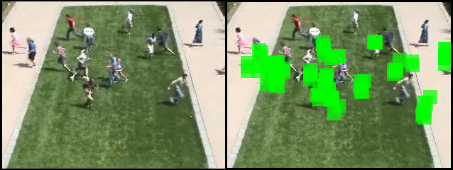
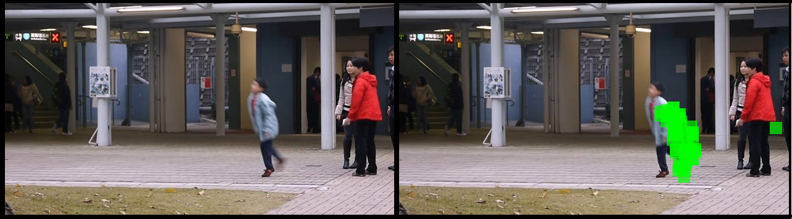
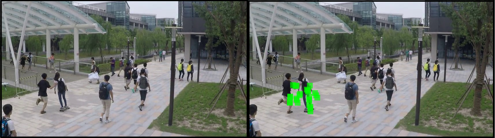

# DDN-for-video-anomaly-detection

Videos captured are mostly non-stationary in nature. To handle such non-stationarity nature, we propose a prediction framework using a deep time recursive differencing network followed by autoregressive moving average estimation for video anomaly detection. We demonstrate the effectiveness of the proposed approach on UCSD, UMN, Avenue and ShanghaiTech datasets.

Anomalies detected in video frames from the different datasets:

|vehicle|sudden running|skipping|skating on pedestrian road|
|-|-|
|||||
